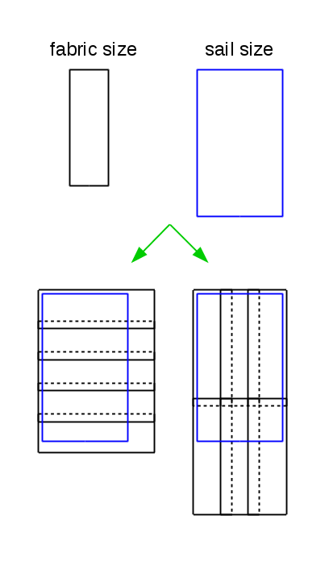

# Plachty #

Úkolem je vytvořit program, který bude počítat množství látky potřebné pro vyrobení plachty.

Předpokládáme, že máme k dispozici látku pro výrobu plachet. Látka se dodává ve tvaru obdélníků v zadaném rozměru (výška, šířka). Dále dostaneme informaci o požadované velikosti plachty. Plachta je obdélníkového tvaru, zadaná je výška a šířka. Program určí, kolik kusů látky je potřeba sešít, aby vznikla plachta požadované velikosti.

Práce programu je trochu ztížena tím, že látky se v místě švu musí překrývat. Program tedy po načtení velikosti látky a plachty zjistí, zda bude potřeba látku sešívat. Pokud ano, zeptá se ještě na požadovanou velikost překryvu.

Při sešívání předpokládáme, že obdélníkové kusy látky skládáme vždy ve stejné orientaci v pravoúhlém rastru. Tedy obdélníky jsou buď všecnhy ponechané v zadané orientaci, nebo všechny otočené o 90 stupňů. Dále předpokládáme, že případné přebývající kusy látky nelze znovu využít.



Vstupem programu je zadání:

* velikosti látky - šířka a výška, desetinná čísla,
* velikosti požadované plachty - výška a šířka, desetinná čísla a
* velikost překryvu v místě švu (desetinné číslo). Program se na tuto informaci dotazuje jen pokud je potřeba látku sešívat.

Výstupem programu je nejmenší počet kusů látky potřebných pro výrobu plachty. Pro některé kombinace vstupů nelze plachtu vyrobit, program pak toto zobrazí (viz ukázka).

Pokud je vstup neplatný, program to musí detekovat a zobrazit chybové hlášení. Chybové hlášení zobrazujte na standardní výstup (ne na chybový výstup). Za chybu považujte:

* nečíselné zadání výšky, šířky nebo velikosti překryvu,
* výška nebo šířka je záporná nebo nulová,
* velikost překryvu je záporná (tedy připouští se nulový překryv),
* chybějící zadání výšky, šířky,
* chybějící zadání překryvu (v místě, kde je informace o překryvu nutná).

## Ukázka práce programu: ##

Velikost latky:

2.5 3

Velikost plachty:

12 5

Prekryv:

0

Pocet kusu latky: 8

---

Velikost latky:

2.5 3

Velikost plachty:

12 5

Prekryv:

0.2

Pocet kusu latky: 12

---

Velikost latky:

4 3

Velikost plachty:

5 4

Prekryv:

0.1

Pocet kusu latky: 2

---

Velikost latky:

3 4

Velikost plachty:

2 2

Pocet kusu latky: 1

---

Velikost latky:

1e100 1e100

Velikost plachty:

3e100 3e100

Prekryv:

1e99

Pocet kusu latky: 16

---

Velikost latky:

0.71 1

Velikost plachty:

4.91 1.7

Prekryv:

0.01

Pocet kusu latky: 14

---

Velikost latky:

2 2

Velikost plachty:

5 1

Prekryv:

1.5

Pocet kusu latky: 7

---

Velikost latky:

2 1

Velikost plachty:

5 1

Prekryv:

1.5

Pocet kusu latky: 7

---

Velikost latky:

1 1

Velikost plachty:

5 1

Prekryv:

1.5

Nelze vyrobit.

---

Velikost latky:

3 abcd

Nespravny vstup.

---

Velikost latky:

-5 1

Nespravny vstup.

## Poznámky: ##
* Znak odřádkování (\n) je i za poslední řádkou výstupu (i za případným chybovým hlášením).
* Pro reprezentaci hodnot použijte desetinná čísla typu double. Nepoužívejte typ float, jeho přesnost nemusí být dostatečná.
* Úlohu lze vyřešit bez použití funkcí. Pokud ale správně použijete funkce, bude program přehlednější a bude se snáze ladit.
* Číselné vstupní hodnoty jsou zadávané tak, aby se vešly do rozsahu datového typu double, výsledek se vejde do rozsahu datového typu int.
* Při programování si dejte pozor na přesnou podobu výpisů. Výstup Vašeho programu kontroluje stroj, který požaduje přesnou shodu výstupů Vašeho programu s výstupy referenčními. Za chybu je považováno, pokud se výpis liší. I chybějící nebo přebývající mezera/odřádkování je považováno za chybu. Abyste tyto problémy rychle vyloučili, použijte přiložený archiv se sadou vstupních a očekávaných výstupních dat. Podívejte se na videotutoriál (edux -> výuková videa), jak testovací data použít a jak testování zautomatizovat.
* Váš program bude spouštěn v omezeném testovacím prostředí. Je omezen dobou běhu (limit je vidět v logu referenčního řešení) a dále je omezena i velikost dostupné paměti (ale tato úloha by ani s jedním omezením neměla mít problém). Testovací prostředí dále zakazuje používat některé "nebezpečné funkce" -- funkce pro spouštění programu, pro práci se sítí, ... Pokud jsou tyto funkce použité, program se nespustí. Možná ve svém programu používáte volání:

``` c
int main ( int argc, char * argv [] )
{
 
  ...
     
  system ( "pause" ); /* aby se nezavrelo okno programu */
  return 0;
}
```
  
Toto nebude v testovacím prostředí fungovat - je zakázáno spouštění jiného programu. (I pokud by se program spustil, byl by odmítnut. Nebyl by totiž nikdo, kdo by pauzu "odmáčkl", program by čekal věčně a překročil by tak maximální dobu běhu.) Pokud tedy chcete zachovat pauzu pro testování na Vašem počítači a zároveň chcete mít jistotu, že program poběží správně, použijte následující trik:

``` c
int main ( int argc, char * argv [] )
{
 
  ...

#ifndef __PROGTEST__
  system ( "pause" ); /* toto progtest "nevidi" */
#endif /* __PROGTEST__ */
  return 0;
}
```

* Slovní popis struktury platných vstupních dat není zcela exaktní. Proto na výtky některých studentů přikládáme i popis vstupního jazyka v EBNF:

input      ::= { whiteSpace } fabric { whiteSpace } sail { whiteSpace } [ overlap { whiteSpace } ]
    
whiteSpace ::= ' ' | '\t' | '\n' | '\r'
    
fabric     ::= decimal { whiteSpace } decimal
    
sail       ::= decimal { whiteSpace } decimal
    
overlap    ::= decimal
    
decimal    ::= [ '+' ] integer [ '.' integer [ ( 'e' | 'E' ) [ '+' | '-' ] integer ] ]  |
                   [ '+' ] '.' integer [ ( 'e' | 'E' ) [ '+' | '-' ] integer ]
    
integer    ::= digit { digit }
    
digit      ::= '0' | '1' | '2' | '3' | '4' | '5' | '6' | '7' | '8' | '9'
