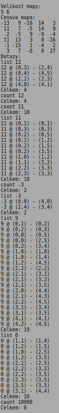
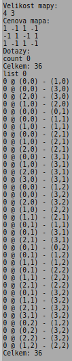
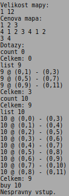
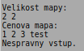
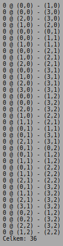
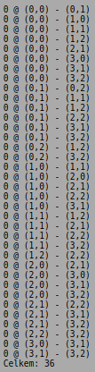

# Investice do pozemků #

Úkolem je vytvořit program, který bude vyhledávat optimální investice do pozemků.

Na vstupu programu je zadání cen parcel. Předpokládáme, že parcely leží v pravoúhlém rastru, kde známe počet řádek a sloupců. Cena je známá pro každou parcelu, jedná se o celé číslo (kladné, nulové, záporné). Záporná (nulová) cena parcely je přípustná, může se např. jednat o parcelu s břemenem. Po zadání cen pozemků následuje seznam dotazů. Chceme investovat zadaný objem peněz a hledáme parcelu/parcely, které mají v součtu cenu přesně rovnou zadanému objemu peněz. Jsme ale omezeni tím, že můžeme nakupovat pouze sousední parcely. Zakoupené parcely navíc musí tvořit obdélník či čtverec v rastru. Program dokáže zpracovávat dotazy dvou typů: buď pouze zobrazí počet různých možností, jak investovat zadanou částku (dotaz count), nebo navíc vypíše i seznam parcel, které dotazu vyhovují (dotaz list).

Vstupem programu je:

* velikost rastru (šířka, výška), velikost je omezena na 1 až 2000 v každém směru,
* ceny jednotlivých parcel, ceny jsou zadané po řádcích,
* seznam dotazů.

Dotaz je buď typu count x nebo list x, kde x je investovaná částka.

Výstupem programu je vyřešení dotazů:

* na dotaz typu count x je odpovědí počet různých způsobů, kterými lze investovat částku x,
* na dotaz typu list x je odpovědí seznam alokací parcel, následovaný počtem nalezených alokací (tedy číslo stejné, jaké by vrátil dotaz typu count x). Seznam alokací parcel má podobu:

`x @ (x1,y1) - (x2,y2)` 
    
kde x1,y1 je souřadnice levého horního rohu alokace parcel a x2,y2 je souřadnice pravého dolního rohu alokace parcel.

Pokud je vstup neplatný, program to musí detekovat a zobrazit chybové hlášení. Chybové hlášení zobrazujte na standardní výstup (ne na chybový výstup). Za chybu považujte:

* rozměr rastru je nečíselný, nulový, záporný nebo překračuje limit 2000,
* zadaná cena parcel není číslo,
* dotaz není typu count ani list,
* číslo v dotazu chybí / není správně zadané.

Před implementací programu si rozmyslete, jakým způsobem budete reprezentovat ceny pozemků a jak budete v zadaném rastru vyhledávat. Velikost rastru je omezená na max. 2000 prvků v každém směru. Pro řešení tedy postačuje staticky alokovaná paměť.

Vyhledávání v cenách pozemků může trvat velmi dlouho. Naivní řešení má složitost n6, vylepšováním algoritmu se dá složitost výrazně snížit. Časové limity testovacího prostředí jsou nastavené tak, aby rozumná implementace naivního algoritmu prošla všemi testy mimo testů bonusových.

## Ukázka práce programu: ##

---

---

---

## Poznámky: ##

* Znak odřádkování (\n) je i za poslední řádkou výstupu (i za případným chybovým hlášením).
* Pro reprezentaci cen parcel postačuje datový typ int.
* Souřadnice (0,0) odpovídá levému hornímu rohu mapy, souřadnice rostou směrem vpravo a směrem dolů..
* Dynamická alokace není v této úloze potřeba. Maximální velikost rastru je omezená, paměťové limity postačují pro statickou alokaci. Je ale možné, že se některé reprezentace cenové mapy nevejdou do lokálních proměnných. V takovém případě může být řešením cenovou mapu alokovat v datovém segmentu (hint: klíčové slovo static).
* Odřádkování v cenové mapě na vstupu může, ale nemusí respektovat velikost rastru. Program se při načítání vstupu nemusí odřádkováním zabývat, pro zpracování mu stačí dříve zadaná velikost rastru.
* Pro velké velikosti rastru v bonusových testech je nalezeno velké množství vyhovujících alokací. Samotný výpis těchto alokací je dost pomalý. Proto se v bonusových testech kontrolují pouze dotazy typu count.
* Pořadí vyhovujících alokací v dotazech typu list není určené. Vaše implementace může nalezené alokace vypisovat v libovolném pořadí, testovací prostředí si před porovnáním pořadí ve výpisu upraví. Tedy například pro zadání:

`Velikost mapy:`

4 3

`Cenova mapa:`

1 -1 1 -1

-1 1 -1 1

1 -1 1 -1

`Dotazy:`

list 0

jsou přípustné odpovědi:

nebo:

nebo libovolná další ze zbývajících 371993326789901217467999448150835199999998 permutací.

* Slovní popis struktury platných vstupních dat není zcela exaktní. Proto na výtky některých studentů přikládáme i popis vstupního jazyka v EBNF:

input      ::= { whiteSpace } gridSize { whiteSpace }priceMap { whiteSpace } queryList 

whiteSpace ::= ' ' | '\t' | '\n' | '\r'

gridSize   ::= integer { whiteSpace } integer

priceMap   ::= integer { { whiteSpace } integer }

queryList  ::= { query { whiteSpace } }

query      ::= ( 'list' | 'count' ) { whiteSpace } integer  

integer    ::= ['+' | '-'] digit { digit }

digit      ::= '0' | '1' | '2' | '3' | '4' | '5' | '6' |'7' | 
'8' | '9'
