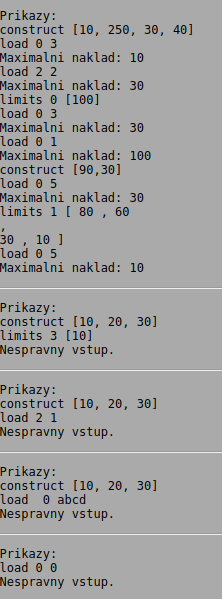

# Dálnice #

Úkolem je vytvořit program, který bude vyhledávat maximální možné zatížení kamiónů na dálnici.

ČR trápí nedostatečně dimenzovaná síť dálnic. Vláda si je problému vědoma. Navíc se blíží volby a je potřeba voličům ukázat, že se vláda o jejich problémy zajímá (všimněte si, že zde není řečeno nic o řešení těchto problémů). Vláda se proto rozhodla zpracovat studii, proč občané považují dálniční systém za nevyhovující. Studie odhalila zásadní problém: chybějící kontrola zatíženi kamiónů, které dálnici nadměrně opotřebovávají. Ministerstvo dopravy proto vypracovalo registr který umožní lépe koordinovat vytěžování kamiónů vzhledem k aktuální situaci oprav dálnice. Registr je zatím pilotně zkoušen na dálnici D1. Dálnice je rozdělena do úseků mezi jednotlivými nájezdy. Pro každý úsek dálnice je známá jeho maximální nosnost - úsekem nesmí projíždět vozidla, která tuto nosnost překračují. Maximální nosnost úseku je zadaná při výstavbě dálnice a dále může být upravována (například při opravě). Registr dále umožňuje dopravcům vypočítat, jaká je maximální hmotnost kamiónu, který projíždí zadaný úsek dálnice.

Implementace takového složitého a drahého registru je náročná, proto byla svěřena zavedené firmě HAL. Ta (podle zavedené tradice) informační systém neimplementovala, ale zadala jej menší a méně zavedené společnosti P3 UFMFGPOJDB, která (opět dle tradice) zakázku přihrála dále ještě méně zavedené firmě VOJDPSO, ... , a přes další prostředníky se implementace dostala až na Vás.

Registr pracuje interaktivně. Na vstupu jsou zadávané jednotlivé příkazy, zadávání příkazů končí koncem vstupu (EOF). Příkazy jsou 3 druhů:

* construct [x,y,z, ...] Tento příkaz je zadaný po dostavbě dalších úseků dálnice. V hranatých závorkách jsou zadané maximální přípustné hmotnosti vozidel v dokončených úsecích. Jednotlivé hmotnosti jsou kladná čísla, čísla jsou oddělená čárkou. Po zadání tohoto příkazu se příslušným způsobem zvětší povolený rozsah indexů úseků dálnice,
* limits x [y,z,ž, ...] Tento příkaz nastaví nové limity nosnosti zadaných úseků dálnice. Nastavení se týká úseku x (limit nastaven na hodnotu y), dále úseku x+1 (limit nastaven na hodnotu z), úseku x+2 (limit nastaven na hodnotu ž), ...
* load x y Tento příkaz vypočte maximální přípustnou hmotnost kamiónu, který má projet úseky x, x+1, x+2, ..., y.

Výstupem programu je vyřešení dotazů, tedy pro každý příkaz load bude odpovědí nalezená maximální hmotnost kamiónu.

Pokud je vstup neplatný, program to musí detekovat a zobrazit chybové hlášení. Chybové hlášení zobrazujte na standardní výstup (ne na chybový výstup). Za chybu považujte:

* je zadaný jiný příkaz než construct, limits a load,
* u příkazu construct nebyl zadaný správný seznam nosností jednotlivých úseků dálnice (chybí hranaté závorky, oddělující čárky, zadané nosnosti nejsou celá kladná čísla, prázdný seznam),
* u příkazu limits byl zadaný nesprávný první měněný úsek dálnice (celé číslo v rozsahu 0 až délka dálnice), nebyl zadaný správný seznam nosností jednotlivých úseků dálnice (chybí hranaté závorky, oddělující čárky, zadané nosnosti nejsou celá kladná čísla, prázdný seznam), nebo se příkaz pokouší měnit nosnost úseku dálnice, který ještě neexistuje (za koncem existující dálnice),
* u příkazu load nebyl správně zadaný první nebo poslední úsek dálnice (celé čísla v rozsahu od 0 do existujícího počtu úseků dálnice, číslo počátečního úseku musí být menší nebo rovné číslu koncového úseku dálnice).

Před implementací programu si rozmyslete, jakým způsobem budete reprezentovat nosnosti jednotlivých úseků dálnice. Počet úseků dálnice může být velmi vysoký, neexistuje žádná daná horní mez. Pokud byste se rozhodli alokovat počet úseků dálnice fixně na nějaké vysoké hodnotě, neprojdete základním testem (základní test má velmi omezenou velikost paměti). Paměťové nároky Vašeho řešení musí rozumně korelovat s velikostí řešeného problému.

Vyhledávání může trvat velmi dlouho, zejména pokud je úseků dálnice velké množství. Časové limity jsou nastavené tak, že rozumně implementovaný základní algoritmus vyhledávání projde všemi testy kromě testu bonusového. Bonusový test vyžaduje pokročilý algoritmus vyhledávání. Můžete vycházet z toho, že vyhledávání maximální přípustné hmotnosti kamiónu je velmi časté, naopak rozšiřování dálnice a změna nosnosti úseků dálnice se používá málo často. Vyplatí se proto nějaká forma předzpracování.

## Ukázka práce programu: ##

## Poznámky: ##

* Znak odřádkování (\n) je i za poslední řádkou výstupu (i za případným chybovým hlášením).
* Pro reprezentaci nosnosti/hmotnosti postačuje datový typ int.
* Program nelze vytvořit bez dynamické alokace paměti.
* V programu používejte prostředky jazyka C, nepoužívejte C++ (STL).
* Při načítání dat ze vstupu je potřeba rozumně efektivní implementace. Pokud byste potřebovali zvětšovat velikost nějakého dynamicky alokovaného pole, nezvětšujte jej po jednotlivých prvcích.
* Slovní popis struktury platných vstupních dat není zcela exaktní. Proto na výtky některých studentů přikládáme i popis vstupního jazyka v EBNF:
    
    input      ::= { whiteSpace } { command { whiteSpace } }
    
    whiteSpace ::= ' ' | '\t' | '\n' | '\r'
    
    command    ::= 'load' { whiteSpace } integer { whiteSpace } integer 
                 
                 | 'limits' { whiteSpace } integer { whiteSpace } list 
                 
                 | 'construct' { whiteSpace } list 
    
    list       ::= '[' { whiteSpace } integer { listRest } { whiteSpace } ']' { whiteSpace }             
    
    listRest   ::= { { whiteSpace } ','  { whiteSpace } integer }
    
    integer    ::= ['+' | '-'] digit { digit }
    
    digit      ::= '0' | '1' | '2' | '3' | '4' | '5' | '6' | '7' | '8' | '9'
