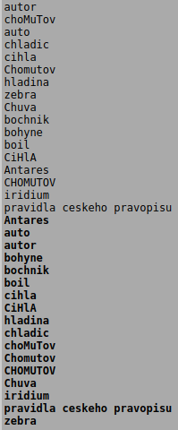
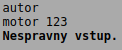

# CZ SORT #

Úkolem je vytvořit program, který bude řadit text na svém vstupu.

Vstupem programu jsou řetězce. Každý řetězec je zadaný na samostatné řádce. Řetězec je tvořen znaky abecedy a-z, A-Z a mezerami (v bonusovém testu též diakritickými znaky, viz níže). Program tyto řetězce načte, seřadí je a vypíše ve vzestupném pořadí. Při řazení nebudou rozlišovaná malá a velká písmena. Navíc program musí zohlednit správné řazení dvojhlásky ch ( ... c, d, e, f, g, h, ch, i, j, ...).

Výstupem programu jsou abecedně seřazené vstupní řetězce. Každý řetězec je uveden na jedné výstupní řádce.

Pokud je vstup neplatný, program to musí detekovat a zobrazit chybové hlášení. Chybové hlášení zobrazujte na standardní výstup (ne na chybový výstup). Po detekování chyby se program ukončí. Za chybu považujte:

* na vstupu je řetězec obsahující neplatný znak (mimo a-z, A-Z, mezery a diakritických znaků),
* vstupní znak porušuje pravidla kódování UTF-8 (bonusové testy).

V základní variantě stačí, aby program pracoval správně se znaky bez diakritiky. Tedy základní varianta programu může odmítat české diakritické znaky. I základní varianta programu ale musí správně řadit ch. Takové řešení projde všemi testy kromě testu bonusového. Pokud chcete získat body i z bonusové části, musíte správně načítat a řadit české diakritické znaky.

## Ukázka práce programu: ##

---

## Poznámky: ##

* V ukázkovém běhu programu jsou vizuálně odlišené uživatelské vstupy (standardní font) a výpisy programu (tučné písmo). Toto rozlišení je použité pouze zde na WWW stránce zadání problému, aby se výpis snáze četl. Realizovaný program musí zobrazovat text bez dalších úprav (nepoužívá žádný markup), viz též přiložené soubory.
* Znak odřádkování (\n) je i za poslední řádkou výstupu (i za případným chybovým hlášením).
Program nelze vytvořit bez dynamické alokace paměti.
* V programu používejte prostředky jazyka C, nepoužívejte C++ (STL).
* Při načítání dat ze vstupu je potřeba rozumně efektivní implementace. Pokud byste potřebovali zvětšovat velikost nějakého dynamicky alokovaného pole, nezvětšujte jej po jednotlivých prvcích.
* České diakritické znaky jsou:
  
á č ď é ě í ň ó ř š ť ú ů ý ž

Á Č Ď É Ě Í Ň Ó Ř Š Ť Ú Ů Ý Ž
   
* Bonusový test vyžaduje rozumně efektivní algoritmus řazení.
* Při řazení diakritických znaků v bonusovém testu jsou použita následující zjednodušení:
    * dlouhé a krátké samohlásky jsou považované za stejné. O pořadí rozhodují až případné další znaky slova. Tedy například následující slova mají shodnou předponu by/bý, o řazení rozhoduje následující znak (d, k, l, t, v):

    bydlet

    býk

    bylina

    byt

    bývala
     
    * Znaky s háčkem jsou řazeny za znaky bez háčku. Platí i pro znak ě. Tedy například:
    
    džus
      
    Ďábel
      
    Elbrus
     
    * písmeno ch se řadí za h,
    * nerozlišujeme malá a velká písmena.
* Slovní popis struktury platných vstupních dat není zcela exaktní. Proto na výtky některých studentů přikládáme i popis vstupního jazyka v EBNF:
    

input      ::= { line '\n' }

line       ::= { letter | czLetter | ' ' }

letter     ::= 'A' | 'B' | ... | 'Z' | 'a' | 'b' | ... | 'z'

czLetter   ::= 'á' | 'Á' | 'č' | 'Č' | ... | 'ž' | 'Ž'
