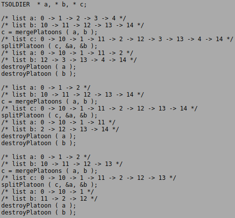

# Pořadová cvičení #

Úkolem je vytvořit sadu funkcí, které budou pracovat se spojovými seznamy. Spojové seznamy reprezentují vojáky a implementované funkce jsou rozkazy při pořadových cvičeních.

Voják v našem programu bude reprezentovaný strukturou TSOLDIER. Četa vojáků (platoon) je pak seznamem vojáků. Pro realizaci je zvolen jednosměrně zřetězený spojový seznam, kdy voják odkazuje na svého kolegu v řadě za ním. Poslední voják v četě má nastaven odkaz následníka na NULL. Pro reprezentaci celé čety si tak stačí pamatovat odkaz na prvého vojáka.

Realizujte následující funkce (rozkazy) pro četu:

` TSOLDIER * mergePlatoons ( TSOLDIER *a, TSOLDIER *b );`

Funkce slouží ke sloučení dvou čet. Původní seznamy (čety) zaniknou, vojáci jsou z nich přeskupeni do nové (větší) čety sloučené. Sloučená četa je (resp. první voják v této nové četě) je pak návratovou hodnotou. Slučování samozřejmě není náhodné. První voják nově zformované čety bude první voják z čety a, po něm následuje první voják z čety b, druhý z a, druhý z b, atd.

`void splitPlatoon (TSOLDIER *src, TSOLDIER ** a, TSOLDIER ** b )`

Funkce slouží k rozdělení čety src na dvě menší čety. První polovina seznamu z čety src bude předaná jako výstupní parametr a, druhá polovina čety src bude předaná jako výstupní parametr b. Čety a a b budou tedy mít stejný počet vojáků (prvků). Pokud byl počet vojáků v původní četě lichý, bude poslední voják v seznamu odstraněn (např. zastřelen, ztráty jsou na vojně povolené).

`void destroyPlatoon (TSOLDIER * x );`

Funkce slouží k uvolnění paměti alokované pro vojáky v četě. Testovací prostředí tuto funkci zavolá pro každou vytvořenou četu, která již nadále není potřeba.

`struktura TSOLDIER`

Struktura popisuje jednoho vojáka. Má celkem 3 složky:

* m_Next je ukazatelem na následujícího vojáka v četě, NULL pro posledního vojáka v četě,
* m_PersonalID je číslo vojáka,
* m_SecretRecord jsou tajné osobní informace o vojákovi. Vaše funkce je nepotřebuje ani číst ani zapisovat. Jen je potřeba je zachovat v neporušeném stavu ve struktuře vojáka.

Vstupní parametry (tedy spojové seznamy) pro Vaše funkce bude připravovat testovací prostředí. Prvky spojových seznamů budou alokované pomocí funkce malloc. Pokud některá Vaše funkce bude prvky spojového seznamu rušit, musí k uvolnění paměti použít funkci free (NEpoužívejte C++ delete). Funkce pro přeskupování vojáků nebudou vytvářet nové záznamy. Účelem je přeskupit stávající prvky ve spojovém seznamu tak, aby pořadí vyhovělo zadání. Váš program MUSÍ přeskupovat odkazy na další vojáky. Nepokoušejte se kopírovat obsahy struktur TSOLDIER mezi sebou. Kopírování obsahů struktur je jednak pomalejší a testovací prostředí je udělané tak, aby to poznalo a vyhodnotilo jako chybu.

Odevzdávejte zdrojový kód, který obsahuje Vaši implementaci požadovaných funkcí. Do odevzdávaného souboru samozřejmě patří ještě další Vaše funkce, které jsou z funkce Vašich funkcí volané. Naopak, v odevzdávaném souboru nesmí být vkládání hlavičkových souborů a funkce main (pokud vkládání hlavičkových souborů a funkci main zabalíte do bloku podmíněného překladu, mohou zůstat). Za základ řešení použijte ukázku níže. Ukázku si zkopírujte a doplňte pouze implementaci požadované funkce (případně dalších Vašich funkcí). Pokud zachováte bloky podmíněného překladu, můžete takový soubor odevzdávat Progtestu.

``` c
#ifndef __PROGTEST__
#include <stdio.h>
#include <stdlib.h>

typedef struct TSoldier
 {
   struct TSoldier   * m_Next;
   int                 m_PersonalID;
   char                m_SecretRecord[64];
 } TSOLDIER;

#endif /* __PROGTEST__ */

TSOLDIER         * mergePlatoons                           ( TSOLDIER        * p1,
                                                             TSOLDIER        * p2 )
 {
 }
 
void               splitPlatoon                            ( TSOLDIER        * src, 
                                                             TSOLDIER       ** p1,
                                                             TSOLDIER       ** p2 )
 {
 }
 
void               destroyPlatoon                          ( TSOLDIER        * src )
 {
 }
  
#ifndef __PROGTEST__
int main ( int argc, char * argv [] )
 {
   /* Vase testy */
 }
#endif /* __PROGTEST__ */
```

Úloha je omezena dobou běhu a dostupnou pamětí. Tato úloha není náročná na paměť ani na dobu běhu. Je však náročná na pečlivou práci s ukazateli. Dejte zejména pozor na ukončující hodnoty NULL na konci spojového seznamu. Dále, četa reprezentovaná parametrem s hodnotou NULL je platným vstupem - četou s 0 vojáky, kterou lze sloučit (nepřidá nic), rozdělit (obě nové čety budou prázdné) či zničit (uvolnění nedělá nic).

Ukázka použití funkcí:


